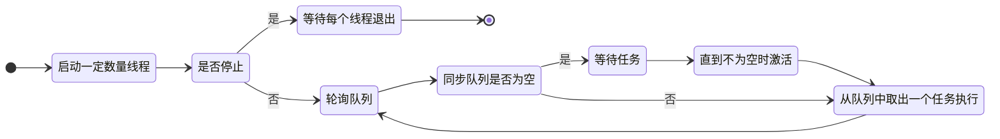
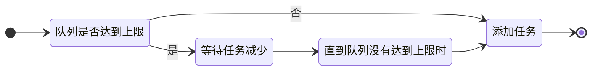

# 半同步半异步线程池

## 原理

半同步半异步线程池分为三层：

- 同步服务层：处理来自上层的任务请求
- 同步排队层：来自上层的任务请求都会追加到排队层中等待处理
- 异步服务层：多个线程同时处理排队层中的任务

线程池执行任务的活动图



往线程池添加任务的活动图



## 测试

我在 `main.cpp` 中添加了 100000 个线程对同一个数进行加操作，每个线程加 100 次。并在这些线程中使用互斥锁

在当前目录下执行

```bash
make run
```

得到如下输入

```bash
total: 10000000
```

## 参考

- 深入应用 C++11
